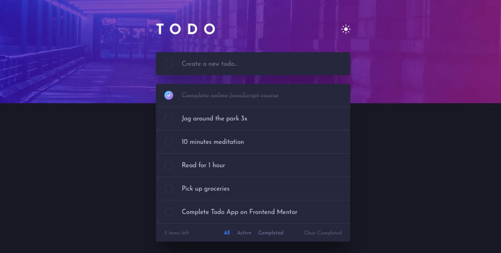
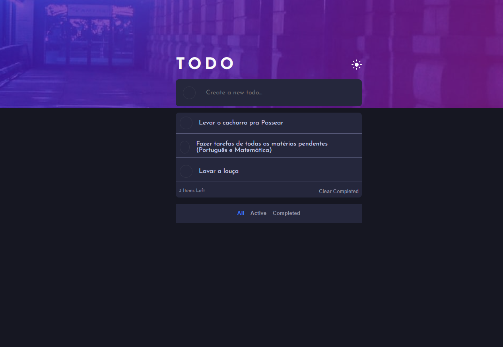
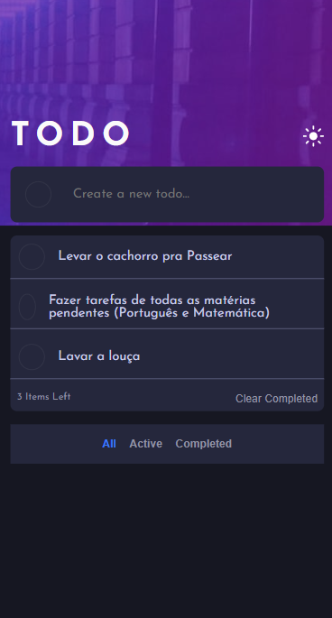

<h1 align="center"> Frontend Mentor - Solução de Todo App</h1>

Essa é uma solução para o [Desafio Todo App](https://www.frontendmentor.io/challenges/todo-app-Su1_KokOW). Os desafios do Frontend Mentor ajudam você a aprimorar suas habilidades de programação por meio da criação de projetos realistas.

    

## 💻 Projeto

Este projeto é um gerenciador de tarefas, onde você pode:
- Criar Tarefas
- Marcar/Desmacar como concluídas
- Excluir tarefas concluídas
- Filtrar tarefas concluídas/pendentes
- Alternar entre modo claro e escuro

## Acesse o Todo App [clicando aqui](https://antoniorafaeldev.github.io/todo-app/)

## 🚀 Tecnologias

Esse projeto foi desenvolvido com as seguintes tecnologias:

- HTML
- CSS
- JavaScript
- Git e GitHub

### O Que Aprendi

- Neste projeto, modularizei o código em vários arquivos (um pro dark/light theme switch, outro pra criar tarefas, etc.) e importei as funções num arquivo principal, com o objetivo de organizar melhor o código.

- Além disso, aprendi uma manipulação mais avançada do DOM, como eventos de teclado.

## Screenshot do resultado

### Versão Desktop

 
    

### Versão Mobile

 
    

## Autor 

- Website - [Antônio Rafael](https://github.com/antoniorafaeldev)
- Frontend Mentor - [@Antonio-Rafael-Silva](https://www.frontendmentor.io/profile/antoniorafaeldev)
- Linkedin - [Antônio Rafael](https://www.linkedin.com/in/ant%C3%B4nio-rafael-01131b372/)
